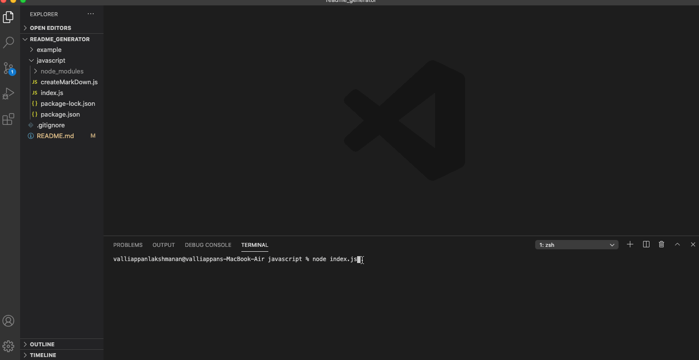

# Readme Generator
Every solid project starts with a well structured readme. The following is a command line interface (CLI) application that creates a well structured readme file based on user inputs.

## Table of Contents

* [Tech used](##Tech-and-concepts-used)
* [Installation](##Installation)
* [Usage](##Usage)
* [Questions](##Questions)

## Tech and concepts used 
* Node/npm
* Inquirer
* Node Filesystem Methods 
* Modular Javascript
* HipSum 'Hipster Lorem Ipsum Generator'

## Installation 

Installation is pretty simple. Just fork this repo and clone to your local computer. Before running any code make sure to run 'npm install' to install all the dependencies listed in package JSON file. 

## Usage 

Using this app is also pretty straigh forward. Open up your terminal to the root directory of this project and simply run the following command - 'node index.js'. Your terminal will then prompt you to answer some basic questions about your project and after all that is done, it will create a readme file for you. If your still confused on how it works, head over to example folder in this repo. It contains a GIF of how to use this project as well as a sample readme file created by this project. You can also view the gif below as well. 

## Questions

Still confused? Think there is a better way I can write my code? Did I miss a key part of functionality? Let me know! Just drop me message on github. 

